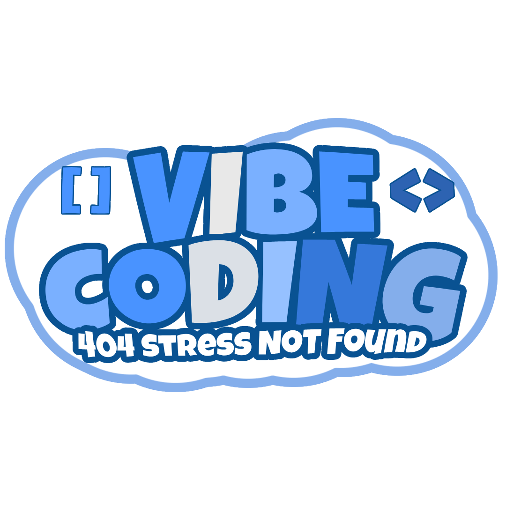
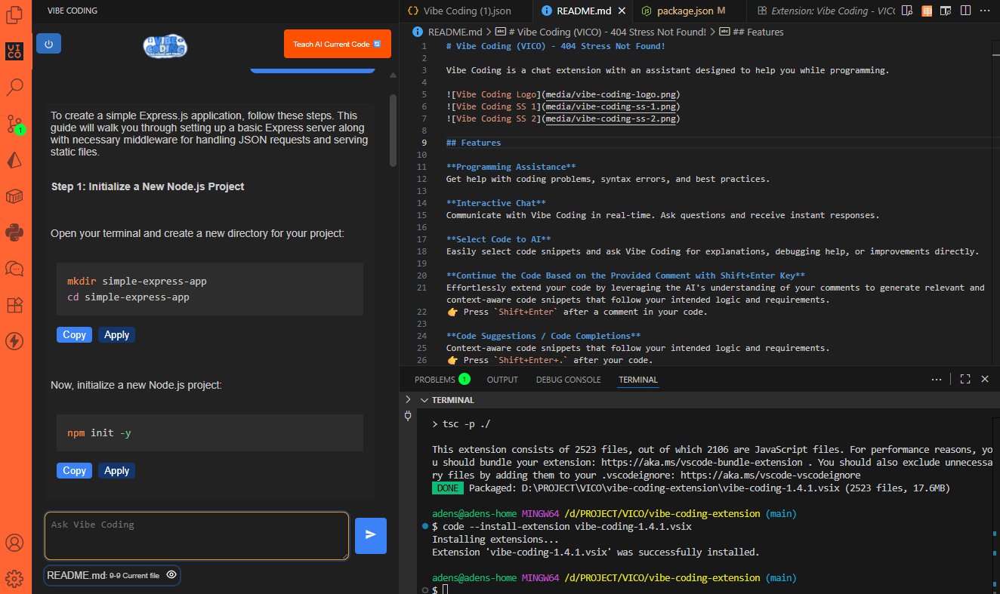
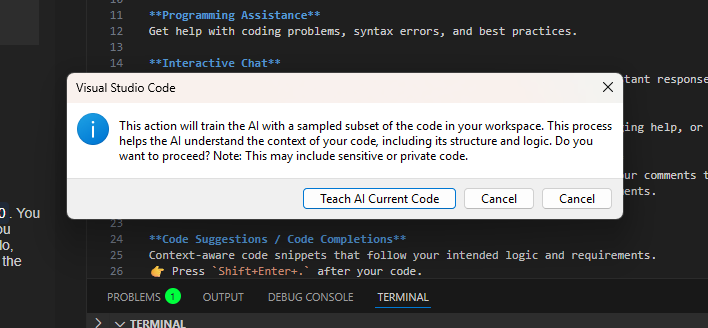

# Vibe Coding - Your Coding Companion

Vibe Coding is a chat extension with an assistant designed to help you while programming.

## Features

**Programming Assistance**  
Get help with coding problems, syntax errors, and best practices.

**Interactive Chat**  
Communicate with Vibe Coding in real-time. Ask questions and receive instant responses.

**Select Code to AI**  
Easily select code snippets and ask Vibe Coding for explanations, debugging help, or improvements directly.

**Continue the Code Based on the Provided Comment with Shift+Enter Key**  
Effortlessly extend your code by leveraging the AI's understanding of your comments to generate relevant and context-aware code snippets that follow your intended logic and requirements.  
👉 Press `Shift+Enter` after a comment in your code.

**Code Suggestions / Code Completions**  
Context-aware code snippets that follow your intended logic and requirements.  
👉 Press `Shift+Enter+.` after your code.

**Generate Full CRUD Pages from Model Schema**  
Automatically generate complete frontend components (Form, List, Detail, Schema, Action) from a simple model description.  
- Just ask: *"Generate model Goat with field: id, name, age, breed"*
- Vibe Coding will guide you to complete the schema.
- Once complete, it generates ready-to-use TypeScript and React files.
- Files are saved directly into your project under `src/models/<model-name>/`.

> ✅ Files generated:
> - `model.schema.ts` (Zod validation)
> - `ModelForm.tsx` (React form)
> - `ModelList.tsx` (Table/list view)
> - `ModelDetailView.tsx` (Detail page)
> - `model.action.ts` (API calls)

---

## Upcoming Features

- **Backend Code Generation**: Extend generation to backend (controllers, routes, services).
- **Custom Templates**: Let users define their own file templates for generation.

---

## Installation

1. **Install the Extension**: Open Visual Studio Code, go to the Extensions view by clicking the Extensions icon in the Activity Bar on the side of the window, or select `View` → `Extensions`.
2. **Search for Vibe Coding**: Type `Vibe Coding` in the search box.
3. **Install**: Click the `Install` button on the Vibe Coding extension from the Marketplace.
4. **Activate**: Once installed, activate the extension by clicking on the Vibe Coding icon in the sidebar.

---

## Usage

1. **Open the Chat**: Click on the Vibe Coding icon in the sidebar to open the chat window.
2. **Login**: Click on the Vibe Coding icon, and log in to start using the assistant.
3. **Start Chatting**: Type your questions or messages, and Vibe Coding will respond.
4. **Get Assistance**: Ask coding-related questions, debugging help, or request code generation.
5. **Generate a Model/Page**:
   - Example prompt: *"Buatkan model GoatCategory dengan field: name (string), createdAt (date)"*
   - AI akan memastikan skema lengkap.
   - Setelah lengkap, AI menghasilkan file dan extension membuatnya di proyek kamu.
   - Cek folder: `src/models/goatCategory/`

---

## Contributing

We welcome contributions! Please feel free to submit pull requests or issues on our [GitHub repository](https://github.com/asepindrak/vibe-coding-extension).

---

## License

This extension is licensed under the MIT License. See the LICENSE file for details.

---

## Release Notes

### 1.2.0
- **feat**: Generate Full CRUD Pages from Model Schema

### 1.1.2
- **fix**: code completions with `Ctrl+Shift+.`

### 1.1.0
- **feat**: code completions

### 1.0.1
- **fix**: update button styles and text in login and logout functionality

### 1.0.0
- **Initial Release**: Vibe Coding.