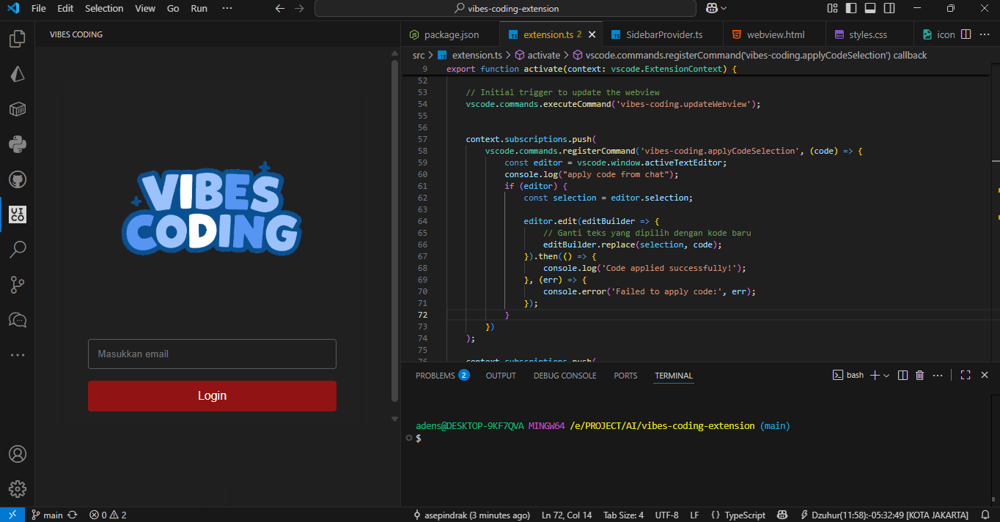

markdown
# Vibes Coding - Your Coding Companion

Vibes Coding is a chat extension with an assistant designed to help you while programming

 <!-- Menambahkan ss pertama -->
        

## Features 

**Programming Assistance**  
Get help with coding problems, syntax errors, and best practices. 

**Interactive Chat**  
Communicate with Vibes Coding in real-time. Ask questions and receive instant responses. 

**Select Code to AI**  
Easily select code snippets and ask Vibes Coding for explanations, debugging help, or improvements directly.

**Continue the Code Based on the Provided Comment with Shift+Enter Key**  
Effortlessly extend your code by leveraging the AI's understanding of your comments to generate relevant and context-aware code snippets that follow your intended logic and requirements.
- Press Shift+Enter key after comment in your code

## Upcoming Features 

- **Code Completion**: Suggests code elements like variable and function names based on the current context. 

## Installation 

1. **Install the Extension**: Open Visual Studio Code, go to the Extensions view by clicking the Extensions icon in the Activity Bar on the side of the window, or select `View` -> `Extensions`. 
2. **Search for Vibes Coding**: Type `Vibes Coding` in the search box. 
3. **Install**: Click the `Install` button on the Vibes Coding extension from the Marketplace. 
4. **Activate**: Once installed, activate the extension by clicking on the Vibes Coding icon in the sidebar.

## Usage 

1. **Open the Chat**: Click on the Vibes Coding icon in the sidebar to open the chat window. 
2. **Back to Extension**: Click on the Vibes Coding icon, and login. 
3. **Start Chatting**: Type your questions or messages, and Vibes Coding will respond. 
5. **Get Assistance**: Ask coding-related questions.

## Contributing 

We welcome contributions! Please feel free to submit pull requests or issues on our [GitHub repository](https://github.com/asepindrak/vibes-coding-extension). 

## License 

This extension is licensed under the MIT License. See the LICENSE file for details.

## Release Notes
### 1.0.0
- **Initial Release**: Vibes Coding.

---